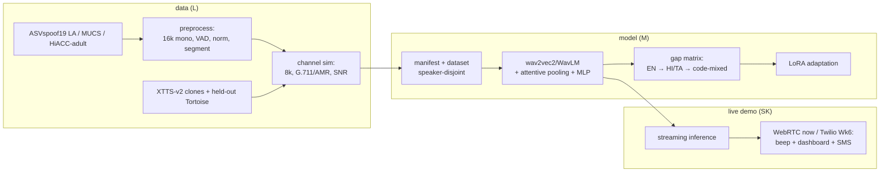

# Quantifying and Closing the Code-Mixing Generalisation Gap in Audio Deepfake Detection

[](https://github.com/Mounika-Reddy-0802/codemix-deepfake-detection/actions/workflows/ci.yml)


Fine-tune wav2vec2 / WavLM on **ASVspoof 2019 LA (English — the only Stage-1
training corpus)**, measure the English → monolingual Hindi/Tamil → code-mixed
Hinglish generalisation gap under a **channel-matched telephony protocol**, close
part of the gap with **LoRA**, and demonstrate it live: a cloned voice on a phone
call triggers a beep in the receiver's ear, a dashboard alert, and an SMS.

> B.Tech final-year capstone. 12-week plan (`PROJECT_PLAN_12_WEEKS.md`);
> tech stack, folder structure, and dataset usage matrix in
> `TECH_STACK_AND_FOLDER_STRUCTURE.md`.

## Pipeline



## Team

| Code | Name | Role (primary ownership) |
|------|------|--------------------------|
| **L**  | M. Lahari (D006) | Data Lead — corpora, preprocessing, channel simulation, spoof generation, dataset docs, ethics/licence compliance |
| **M**  | S. Mounika Reddy (D032) | Model Lead — training pipeline, baseline, gap matrix, LoRA, ablations, experiment tracking |
| **SK** | K. Sai Krishna Reddy (D034) | Systems/Demo Lead — Twilio live-call pipeline, streaming inference, ONNX, dashboard, Gradio demo, deployment |

## The golden rule (do not break)

**Stage-1 trains on ASVspoof 2019 LA (English) only.** IndicSynth, IndicTTS-Deepfake,
IndicVoices, HiACC, and the Tortoise clones are **evaluation-only** and must never
enter a training manifest. HiACC **child** audio is excluded from the pipeline
**entirely** — never bonafide, never a cloning reference. Enforced by
`tests/test_splits.py`. Full rationale in `CLAUDE.md` and `docs/ethics/`.

## Repository layout

See `TECH_STACK_AND_FOLDER_STRUCTURE.md` Section 2 for the annotated tree. Key
points: `data/`, `checkpoints/`, and secrets are gitignored; notebooks contain
no pipeline logic (anything producing a paper number lives in `src/` behind a
config); one shared inference module powers both demos.

## Setup

```bash
# 1. Clone, then install the git hooks (strips any stray attribution trailer)
sh scripts/install_hooks.sh          # or: git config core.hooksPath githooks

# 2. Python environment (Python 3.10+)
python -m venv .venv
source .venv/bin/activate             # Windows: .venv\Scripts\activate
pip install -r requirements.txt
#    ffmpeg must be on PATH for AMR-NB channel simulation (Week 2).

# 3. Secrets
cp .env.example .env                  # fill in W&B / HF / (Twilio, from Week 6)
#    Git identities + PATs live in .env.git (gitignored) — see below.

# 4. Sanity check (Week 1 deliverable)
#    open notebooks/env_check.ipynb  -> loads wav2vec2-base / XLSR-53 / WavLM-base
```

### Git identity / branching (project rule)

Each member commits under their own GitHub identity. **One branch per person per
week** (`week<N>/<firstname>`); all of that person's tasks for the week go on their
branch as small lowercase commits. After a week is complete, its three branches
are **merged into `main`** and pulled, so `main` always holds the finished weeks.
Commit/documentation style follows the reference repo (see `CLAUDE.md`).

## Live-call demo — Twilio timing

Weeks 1–5 use the **free WebRTC (`aiortc`) harness** in `live_call/webrtc_harness/`.
**The Twilio trial is activated in Week 6, not before** (its 30-day window is timed
to cover the integration + demo phase). See `live_call/README.md`.

## Status

**Weeks 1–3 complete** and merged to `main`. Week 1: bootstrap + datasets +
harness + ethics. Week 2: preprocessing, channel simulation, dataset + metrics.
Week 3: spoof-generation drivers (XTTS-v2 + held-out Tortoise) and the Stage-1
training scaffolding. Per-week phase docs in `docs/week*_phase.md`; task log in
`docs/progress.md`; decisions in `docs/problems_and_decisions.md`.

## Honest limitations

- **No paper numbers yet.** Through Week 3 the repo is pipeline + scaffolding.
  Heavy paths (XTTS/Tortoise generation, wav2vec2 training) are validated by lint,
  compile, and pure-logic unit tests; end-to-end runs need the downloaded corpora,
  a GPU, and the mentor ethics sign-off (human steps in `Works updates.md`).
- **CI is intentionally light** (ruff + pytest + numpy/pandas). Tests needing
  torch/torchaudio/librosa skip in CI and run in the full environment.
- **AMR-NB needs ffmpeg**; without it the channel sim falls back to G.711 μ-law.
- The baseline EER gate (defensible published range) is a Week-5 checkpoint — until
  then, no cross-lingual gap number should be trusted.

## Licences

Per-corpus licence table in `docs/licences.md`. Note IndicSynth is CC-BY-NC-4.0
(research use) and the HiACC child-data exclusion. Code licence: TBD by the team.
