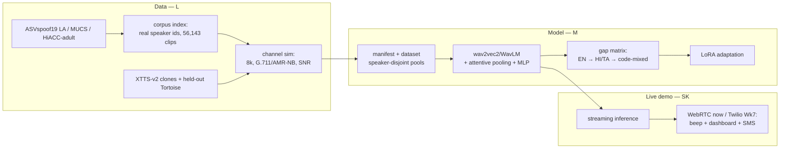

# Quantifying and Closing the Code-Mixing Generalisation Gap in Audio Deepfake Detection

[](https://github.com/Mounika-Reddy-0802/codemix-deepfake-detection/actions/workflows/ci.yml)


An audio deepfake detector trained on English is quietly worse at Hinglish. This
project **measures that gap under a channel-matched telephony protocol**, closes
part of it with LoRA, and demonstrates it live — a cloned voice on a phone call
triggers a beep in the receiver's ear, a dashboard alert, and an SMS.

> **Status: Week 3 of 12 — pipeline complete, no detection numbers yet.**
> Both corpora are indexed and ethics-gated, the telephony channel is verified by
> measurement *and* by ear, the speaker pools are frozen, and spoof generation is
> validated end-to-end on a real GPU (40 clips, 0 failures). Stage-1 training has
> **not** started — it needs ASVspoof 2019 LA, which is not yet on the GPU machine.
> Nothing below is a detection result; see [Honest limitations](#honest-limitations).

---

## Architecture



Two firewalls run through every stage and are enforced by tests rather than by
discipline: **Stage-1 trains on English only**, and **speaker pools never overlap** —
including the voices that get cloned.

## The problem

Anti-spoofing detectors are trained and benchmarked overwhelmingly on English. Real
fraud calls in India are **code-mixed** — Hindi and English alternating *inside a
single utterance* — and arrive over an 8 kHz telephone channel that destroys exactly
the high-frequency artefacts most detectors rely on.

Two shifts stack: **language** and **channel**. Published EERs are measured with
neither. This project measures both, in the condition a detector would actually be
deployed in.

## How it works

| Stage | What it does | Owner |
|---|---|---|
| **1. Corpora + ethics** | MUCS (Kaldi tables, real speaker ids) and HiACC-adult indexed to 56,143 clips. HiACC **child audio quarantined before anything can read it** — a hard project rule, not a filter. | L |
| **2. Channel protocol** | Every eval clip through 8 kHz G.711 μ-law or AMR-NB plus SNR mixing, so the detector is tested on telephony rather than studio audio. | L |
| **3. Spoof generation** | XTTS-v2 clones train-pool voices; Tortoise is held out as the *unseen* attack and never enters a training manifest. | SK |
| **4. Detection** | wav2vec2 / WavLM + attentive stats pooling + MLP head; LoRA for Stage-3 code-mixed adaptation. | M |
| **5. Live demo** | Streaming inference on a real call — WebRTC now, Twilio from Week 7. | SK |

Generation and training are **decoupled by a job table**: `pilot_jobs` assembles a
self-contained, path-portable pack and `spoof_generation` synthesises from it. The
same pack runs on a CPU laptop, a Colab GPU, or the team's RTX 3050 without editing
a single path.

---

## What is validated so far

Every number below is measured on real data on a real machine and is reproducible
from [Reproduce everything else](#reproduce-everything-else).

### Corpora indexed, and the child-audio exclusion holds

| | Count |
|---|---|
| MUCS utterances / speakers | **52,825 / 520** |
| HiACC adult clips / speakers | **3,318 / 24** |
| HiACC child files quarantined | **1,858** |
| Total indexed clips | **56,143** |
| Child ids reachable from any manifest | **0** |

Identical on both machines — which is the point: the dev laptop and the GPU laptop
index the same corpus to the same numbers, so results are comparable across them.
HiACC's own `readme.txt` confirms the adult/child split is **by folder**, which is
what the quarantine sweep keys on, so the exclusion acts on the documented layout
rather than on a guess.
→ [`docs/qa/child_quarantine_evidence.md`](docs/qa/child_quarantine_evidence.md)

### The telephony channel is real, by measurement and by ear

| Condition | SNR | Correlation | Objective pass |
|---|---|---|---|
| G.711 μ-law @ 20 dB | 17.62 dB | 0.991 | 20/20 |
| AMR-NB | 5.57 dB | 0.885 | 20/20 |

All three members rated 20 clean/channel pairs (60/60 rows filled): **telephony
4.0/5, intelligibility 4.0/5**. AMR-NB is materially harsher than G.711 — which is
precisely why both conditions exist.
→ [`docs/qa/channel_sim_verdict.md`](docs/qa/channel_sim_verdict.md)

### Speaker pools frozen before a single clip was generated

25 train / 10 adaptation / 15 eval, **zero speakers in more than one pool**,
SHA-256 `f57e0d85…` committed. Frozen *first*, so the pool firewall is auditable
after the fact rather than trusted at generation time.

### Spoof generation validated end-to-end on GPU

**40 clips, 0 failures** on an RTX 3050 (6 GB), CUDA torch 2.8.0 — a matched A/B:
the same speaker, the same sentence, the same language tag, rendered once from
romanised Hinglish and once from Devanagari.

| | Devanagari | Romanised |
|---|---|---|
| Clips generated | 20 | 20 |
| Failures | 0 | 0 |
| Median speech rate | 13.9 chars/sec | **14.4 chars/sec** |
| Median clip duration | 9.42 s | 10.44 s |

Speech rate is statistically indistinguishable and durations track the ~13 % text
expansion, so **romanisation does not rush or truncate speech**. That is a
pre-screen, not a verdict — the blind rating decides.
→ [`docs/qa/pilot_script_rating_sheet.csv`](docs/qa/pilot_script_rating_sheet.csv)

### The corpus is written in one script, and it is Latin

Nobody on the team reads Devanagari, and a rater who cannot read the target
sentence can only judge whether a clip *sounds* fluent — not whether it said the
right words, which is the one thing the pilot exists to measure.

Filtering could not produce a Latin-only corpus:

| | Count |
|---|---|
| MUCS transcripts | 52,825 |
| …containing **no** Devanagari | 957 (1.8 %) |
| …usable, inside the frozen train pool | **17** |

So the Hinglish is **produced, not selected** — by a hand-rolled transliterator with
no third-party dependency, so it runs in CI and its spellings stay frozen across
the whole corpus. Verified over all 56,143 transcripts: **0 unmapped characters,
0 rows leaking Devanagari**.

```text
मुझे कल बैंक जाना है  →  mujhe kal baink jaanaa hai
करना                  →  karnaa      (not "karanaa" — medial schwa deletion)
संभव                  →  sambhav     (anusvara is "m" before a labial)
ज़रूरी                 →  zarooree    (nukta, not "jaroori")
```

→ **P-014 / P-015** in [`docs/problems_and_decisions.md`](docs/problems_and_decisions.md)

---

## Honest limitations

Owning these is the point.

- **No detection numbers exist yet.** Through Week 3 this repo is pipeline and
  scaffolding. There is no EER, no gap matrix, no LoRA result. Any cross-lingual gap
  figure quoted before the Week-5 baseline checkpoint is not trustworthy.
- **Stage-1 cannot train.** ASVspoof 2019 LA — its *only* training corpus — is not on
  the GPU machine. The earlier download stalled at 25 % because Edinburgh DataShare
  resets on sustained transfers.
- **Generation can fail silently.** One clip of 40 produced **0.83 s of audio from a
  150-character transcript** and raised no exception — the batch runner catches
  crashes, not clips that come out empty. At Week-4 scale that is ~200 dead files
  nobody would notice, so the duration filter (W4-T6) must land *before* the
  4,000-clip run.
- **The script A/B is generated but unrated.** The pre-screen says romanisation looks
  safe; three people still have to listen. Week 4 is blocked on it.
- **Two romanisation choices are judgement calls.** `फ` → `ph` gives `sirph` where a
  Hindi speaker would type `sirf`; `ड़` → `r` gives `thoraa` for `thoda`. Both are
  one-line changes — worth an ear before 4,000 clips bake them in.
- **RVC is toolchain-blocked**, not GPU-blocked: `rvc-python` → `fairseq` → a numpy
  build calling `pkgutil.ImpImporter`, removed in Python 3.12. The second attack
  family is unavailable until that is resolved (**P-017**).
- **The shortlist rests on a proxy.** Speakers were ranked on a dynamic-range proxy,
  not calibrated SNR, and the eligibility gate passed all 520 — so the ordering is a
  hint, not a quality guarantee.
- **AMR-NB needs ffmpeg**; without it the channel sim silently falls back to G.711,
  and the harsher condition is never actually tested.
- **CI is intentionally light** (ruff + pytest + numpy/pandas). Tests needing
  torch/torchaudio/librosa skip in CI and run in the full environment.

---

## Repository structure

```
codemix-deepfake-detection/
├── src/
│   ├── data/            # corpora index, quarantine, channel sim, pilot jobs,
│   │                    #   transliteration, spoof generation, ethics gate
│   ├── models/          # SSL encoder wrapper, attentive pooling, MLP head, LoRA
│   ├── training/        # train loop (AMP, resume, W&B), evaluate, metrics
│   ├── inference/       # streaming inference, ONNX export, predict
│   └── utils/           # device, portable paths, audio, seeding, env check
├── tests/               # 410 tests — pool firewall, anti-leakage, quarantine
├── scripts/             # download/extract (+ child quarantine), preprocess, train
├── configs/             # train/eval/generation configs (notebooks hold no logic)
├── data/manifests/      # clip index, FROZEN speaker pools, pilot job tables
├── docs/                # decisions log, QA evidence, phase notes, licences
├── live_call/           # WebRTC harness now, Twilio from Week 7
└── notebooks/           # env check, pilot, quality audit — no pipeline logic
```

## Quick start

**No GPU, no corpora, no credentials** — see the core of the work in under a minute:

```bash
pip install pandas pytest ruff numpy pyyaml

# The transliteration that makes the corpus readable (P-014)
python -c "from src.data.transliteration import to_roman; \
print(to_roman('मुझे कल बैंक जाना है पैसे निकालने के लिए'))"
# -> mujhe kal baink jaanaa hai paise nikaalne ke lie

# The firewalls that protect every number in the paper
python -m pytest tests/test_splits.py tests/test_pilot_jobs.py -q
```

## Reproduce everything else

```bash
# --- 1. Corpora (only on "run downloads now"; ~15 GB) ---
bash scripts/01_download_data.sh --run
#     Already have the archives? Same extraction, same child quarantine, no network:
DATA_ROOT=/c/dfdata bash scripts/01_download_data.sh --extract-only

# --- 2. Index + verify the ethics exclusion ---
python -m src.data.quarantine --root $DATA_ROOT/raw/hiacc   # audit; a human signs it
python -m src.data.corpora --data-root $DATA_ROOT           # -> clip_index.csv
#     Must print MUCS 52,825/520 and HiACC 3,318/24, or an archive is incomplete.

# --- 3. Channel protocol ---
python -m src.data.listening_test --codec g711 --snr-db 20
python -m src.data.channel_qa                               # objective 20/20 check

# --- 4. Spoof generation (needs the signed ethics note in docs/ethics/) ---
python -m src.data.ethics_gate                              # must exit 0
python -m src.data.pilot_jobs --data-root $DATA_ROOT \
    --pack-dir $DATA_ROOT/generated/pilot --romanise
python -m src.data.spoof_generation --jobs <pack>/generation_jobs.csv \
    --pack-dir <pack> --out-dir <pack>/outputs

# --- 5. The script A/B rating sheet ---
python -m src.data.pilot_rating --roman-pack <roman> --deva-pack <deva> \
    --stage-dir $DATA_ROOT/generated/pilot_ab/clips

# --- 6. Training (blocked: needs ASVspoof 2019 LA) ---
python -m src.training.train --config configs/train_baseline.yaml --smoke
```

Second-machine runbook, including the XTTS weight pre-fetch that avoids a
20-minute non-resumable download:
[`docs/gpu_laptop_setup.md`](docs/gpu_laptop_setup.md).

## The golden rule (do not break)

**Stage-1 trains on ASVspoof 2019 LA (English) only.** IndicSynth, IndicTTS-Deepfake,
IndicVoices, HiACC and the Tortoise clones are **evaluation-only** and must never
enter a training manifest. HiACC **child** audio is excluded **entirely** — never
bonafide, never a cloning reference, never in any manifest. Enforced by
`tests/test_splits.py`, which runs before every training launch.

---

## Progress — Weeks 1–3

Only completed work is listed. This table is extended at the end of each week; the
full 12-week plan lives in
[`PROJECT_PLAN_V2_AFFECTDF.md`](PROJECT_PLAN_V2_AFFECTDF.md).

| Week | L — Data | M — Model | SK — Systems/Demo |
|---|---|---|---|
| **1** | ✅ Download scripts + child quarantine, streaming loaders, licence register | ✅ Repo bootstrap, env check notebook, CI | ✅ WebRTC harness with 16 kHz PCM tap, live-call design |
| **2** | ✅ Preprocessing, G.711 + AMR-NB channel simulation | ✅ Dataset + collate, speaker-disjoint splits, metrics (EER/AUC/F1) | ✅ Adult-speaker selection, XTTS-v2 clone driver + tool firewall |
| **3** | ✅ Corpus-aware indexing (56,143 clips), quarantine verified on both machines, channel listening test passed | ✅ AffectDF related-work anchor, attack taxonomy, env verification | ✅ Speaker pools frozen, XTTS pilot generated on GPU, Devanagari→Latin transliteration |

**Week 3 is not closed yet.** Outstanding: the 40-clip A/B needs three sets of ears,
the AMR-NB listening pass, three PR reviews, and the Week-3 log-book entries. The
40-clip rating and the missing ASVspoof download both block Week 4. Full list in
[`Works updates.md`](Works%20updates.md).

## Team

| Code | Name | Ownership |
|---|---|---|
| **L** | M. Lahari (D006) | **Data** — corpora, preprocessing, channel simulation, generation at scale, ethics/licence compliance |
| **M** | S. Mounika Reddy (D032) | **Model** — training pipeline, baseline, gap matrix, LoRA, ablations, experiment tracking |
| **SK** | K. Sai Krishna Reddy (D034) | **Systems/Demo** — live-call pipeline, streaming inference, ONNX, dashboard, spoof pilots |

One branch per member per week, PRs into `dev`, reviewed and merged by a teammate —
never your own. Full rules in [`GIT_RULES.md`](GIT_RULES.md).

## Documentation index

| Document | What is in it |
|---|---|
| [`docs/RESULTS.md`](docs/RESULTS.md) | **What is actually measured** — the five milestones, and what is not measured yet |
| [`docs/problems_and_decisions.md`](docs/problems_and_decisions.md) | Every decision **P-001 … P-017** with the problem that forced it |
| [`Works updates.md`](Works%20updates.md) | HUMAN_TODO — everything only a person can do, ordered by what unblocks most |
| [`docs/progress.md`](docs/progress.md) | One line per finished task: date, task, owner, branch |
| [`docs/qa/child_quarantine_evidence.md`](docs/qa/child_quarantine_evidence.md) | The child-audio exclusion, verified on both machines |
| [`docs/qa/channel_sim_verdict.md`](docs/qa/channel_sim_verdict.md) | Telephony protocol — objective numbers plus the listening verdict |
| [`docs/gpu_laptop_setup.md`](docs/gpu_laptop_setup.md) | Bringing a second machine to an identical state |
| [`docs/licences.md`](docs/licences.md) | Per-corpus licence table and usage restrictions |
| [`docs/attack_taxonomy.md`](docs/attack_taxonomy.md) | Attack IDs, tool, pool, split — AffectDF Table-1 format |
| [`PROJECT_PLAN_V2_AFFECTDF.md`](PROJECT_PLAN_V2_AFFECTDF.md) | The active 12-week plan (v1 kept for history only) |

## Licences

Per-corpus table in [`docs/licences.md`](docs/licences.md). IndicSynth is CC BY-NC 4.0
(research use); HiACC child data is excluded by project rule, not merely by licence.
Code licence: TBD by the team.
