# Quantifying and Closing the Code-Mixing Generalisation Gap in Audio Deepfake Detection

[](https://github.com/Mounika-Reddy-0802/codemix-deepfake-detection/actions/workflows/ci.yml)


An audio deepfake detector trained on English is quietly worse at Hinglish. This
project **measures that gap under a channel-matched telephony protocol**, closes
most of it with LoRA, and demonstrates it live — a cloned voice on a phone call
triggers a beep in the receiver's ear, a dashboard alert, and an SMS.

> **Status: Week 8 of 12 — the gap is measured, closed, and stress-tested.**
>
> An English-trained detector scoring **0.87% EER** on ASVspoof collapses to
> **44.65%** on code-mixed Hinglish. A LoRA adapter training **1.13% of the
> parameters for 2.2 minutes** brings a held-out code-mixed set from 53.71% to
> **1.34% EER**. But that clean result **does not survive a phone line** — it
> degrades to 38.58% under G.711, and only a channel-matched adapter holds at
> **3.89%**.
>
> ⚠️ **The clean 1.34% is not yet quotable.** It fails this project's own
> shortcut-detection gate (see [The number we are not
> reporting](#-the-number-we-are-not-reporting)). The channel-matched result is
> the defensible one.

---

## Architecture

The pipeline is a single vertical chain: every stage below consumes only what the
stage above produced, and two firewalls (described under the diagram) cut across
all of them.

```mermaid
flowchart TD
    A["1 · CORPORA — L<br/>ASVspoof 2019 LA (English)<br/>MUCS Hindi-English · HiACC-adult"]
    A --> B["2 · CORPUS INDEX — L<br/>56,143 clips · real Kaldi speaker ids<br/>HiACC child audio quarantined on extract"]
    B --> C["3 · SPEAKER POOLS — FROZEN — SK<br/>25 train · 10 adaptation · 15 eval<br/>sha256 f57e0d85… · carved before any audio existed"]
    C --> D["4 · SPOOF GENERATION — SK<br/>XTTS-v2 clones + RVC conversions = seen attacks<br/>Tortoise = held-out, eval only, never trained on"]
    D --> E["5 · TELEPHONY CHANNEL — L<br/>8 kHz · G.711 μ-law / AMR-NB · SNR mixing<br/>verified by measurement and by ear"]
    E --> F["6 · DETECTOR — M<br/>wav2vec2-base + attentive stats pooling + MLP"]
    F --> G["7 · STAGE 1 — ENGLISH ONLY — M<br/>ASVspoof 2019 LA eval<br/>0.87% EER"]
    G --> H["8 · GAP MATRIX — M<br/>same detector on code-mixed Hinglish<br/>44.65% EER — 51× worse"]
    H --> I["9 · STAGE 2 — LoRA ADAPTATION — M<br/>1.13% of parameters, 2.2 min on one GPU<br/>clean 1.34% · channel-matched 3.89%"]
    I --> J["10 · LIVE CALL DEMO — SK<br/>streaming inference over WebRTC now<br/>Twilio from Week 6 · beep + dashboard + SMS"]

    style A fill:#1f3a5f,stroke:#4a90d9,color:#fff
    style B fill:#1f3a5f,stroke:#4a90d9,color:#fff
    style C fill:#1f3a5f,stroke:#4a90d9,color:#fff
    style D fill:#2d4a2b,stroke:#6aa84f,color:#fff
    style E fill:#2d4a2b,stroke:#6aa84f,color:#fff
    style F fill:#4a3a1f,stroke:#d9a441,color:#fff
    style G fill:#4a3a1f,stroke:#d9a441,color:#fff
    style H fill:#5f1f1f,stroke:#d94a4a,color:#fff
    style I fill:#4a3a1f,stroke:#d9a441,color:#fff
    style J fill:#3f1f5f,stroke:#9a4ad9,color:#fff
```



**Two firewalls run through every stage, enforced by tests rather than by discipline:**

1. **Stage-1 trains on English only.** That is what makes the gap a measurement of
   real generalisation rather than an artefact of mixed training data.
2. **Speaker pools never overlap** — including the voices that get cloned. A clone
   of speaker X counts as speaker X, so disjointness holds across bonafide *and*
   spoof.

`tests/test_splits.py` runs before every training launch and fails the build if
either is broken.

---

## The problem

Anti-spoofing detectors are trained and benchmarked overwhelmingly on English. Real
fraud calls in India are **code-mixed** — Hindi and English alternating *inside a
single utterance* — and arrive over an 8 kHz telephone channel that destroys exactly
the high-frequency artefacts most detectors rely on.

Two shifts stack: **language** and **channel**. Published EERs are measured with
neither. This project measures both, in the condition a detector would actually be
deployed in.

---

## Results — what is actually measured

Every number below comes from a real run on real data and is reproducible from
[Reproduce](#reproduce). Read them in order; each one changes how you should read
the last.

### 1. The gap is real, and it is enormous

Same detector, same checkpoint, two evaluation sets.

| Column | Clips | EER | AUC |
|---|---:|---:|---:|
| **English**, unseen attacks (ASVspoof eval, A07–A19) | 71,237 | **0.87%** | 0.9990 |
| **Code-mixed Hinglish** (MUCS real + XTTS spoof) | 4,434 | **44.65%** | 0.533 |

A **51× degradation**, from near-perfect to approximately chance. The 95% CI on the
code-mixed EER is [42.7%, 45.8%], so this is far larger than sampling noise.

**The failure mode is not what the EER implies.** The detector does not merely miss
fakes — it **calls 87.9% of genuine human Hinglish speech "spoof"**, at a median
confidence of P(bonafide) = 0.0014. Both classes collapse toward the spoof end,
which is exactly why AUC sits at 0.533.

→ [`docs/results/gap_matrix_v1.md`](docs/results/gap_matrix_v1.md)

### 2. LoRA closes most of it, cheaply

Both rows below are the **same 3,966 clips** over the **15 held-out eval-pool
speakers**. The only difference is the adapter.

| Model | EER | 95% CI | AUC |
|---|---:|---|---:|
| Stage-1 baseline, unadapted | 53.71% | [52.1%, 55.5%] | 0.459 |
| **+ LoRA code-mix adapter** | **1.34%** | [0.80%, 1.66%] | 0.9997 |

A **40× reduction**, from worse-than-chance to near-solved, by training **1.13% of
the parameters for 2.2 minutes** on one RTX 4500 Ada. Repeated over seeds
1234 / 2025 / 7: **1.45% ± 0.10pp** — the seed is not carrying the result.

→ [`docs/results/gap_closure_v1.md`](docs/results/gap_closure_v1.md)

### 3. …but the clean adapter dies on a phone line

This is the finding that matters most for deployment. Same clips, same speakers;
only the audio condition and the adapter's *training* condition change.

| Adapter trained on | Clean eval | Channel eval (G.711 @ 20 dB) |
|---|---:|---:|
| *(none — Stage-1 baseline)* | 53.71% | 54.92% |
| **Clean audio** | **1.34%** | **38.58%** ❌ |
| **Channel-matched audio** | 13.92% | **3.89%** ✅ |

The clean-trained adapter collapses over a codec, calling **98.9% of spoofs
genuine** — its cue was a vocoder signature above 4 kHz, and the phone line throws
that band away. Channel-matched adaptation recovers it, at a real cost to clean
performance.

**Train for the condition you deploy in.** That single sentence is this project's
main practical contribution.

→ [`docs/results/channel_matched_v1.md`](docs/results/channel_matched_v1.md)

### 4. Adapting to Hinglish costs some English — but not catastrophically

The question a reviewer asks first: did the adapter buy Hinglish by forgetting
English? All three rows scored on the same 71,237-clip ASVspoof eval partition, in
the same session.

| Checkpoint | ASVspoof EER | AUC | Retention cost |
|---|---:|---:|---:|
| Stage-1 baseline | 0.85% | 0.9944 | — |
| LoRA, clean-trained | 8.38% | 0.9297 | **+7.52 pp** |
| LoRA, channel-matched | 4.83% | 0.9562 | **+3.98 pp** |

For scale, AffectDF's Table 13 reports AASIST going **0.83% → 44.52% EER
(+43.69 pp)** after domain adaptation. At +7.52 pp this is a manageable trade, not
catastrophic forgetting — the frozen-encoder argument for LoRA now has a
measurement behind it. Note that the channel-matched adapter **retains English
better *and* survives telephony**, which is a second independent reason to prefer it.

### 5. A second attack family exists — and it does not behave like the first

CM02 (RVC voice conversion) ran on a Kaggle T4 pair on 2026-09-05: **12 per-speaker
voice models**, **1,500 conversions** of real train-pool speech into other train-pool
voices, 0 failures, 93.6% through the mechanical quality screen. The audio and
weights live in a private archive, hash-verified against the manifests in git
(24/24 models, 1,500/1,500 clips).

The measurement it was built to make — P-019 predicted that voice conversion keeps
the source's pitch contour where XTTS invents one:

| Measured with one estimator (`src.data.f0_stats`) | Median f0 IQR |
|---|---:|
| Real MUCS source clips (1,493) | 21.8 Hz |
| RVC conversions of those same clips (1,493) | **21.1 Hz** — 96.4% retained |
| XTTS-v2 pilot clips (23) | **27.8 Hz** |

RVC tracks its source. But XTTS-v2 does **not** compress pitch range as P-019
claimed — it *widens* it by ~27%. P-019's 41.1 Hz real-speech baseline did not
reproduce; its XTTS figure did (**P-021**). The two families deviate from real
speech in opposite directions, which is a cleaner case for a second family than the
original claim was. **No detector has been scored on CM02 yet.**

→ [`docs/results/rvc_generation_v1.md`](docs/results/rvc_generation_v1.md)

### ⚠️ The number we are not reporting

Before trusting any clean-condition figure above, we ran AffectDF's Appendix-G
gate: fit a logistic regression on **eight cheap signal statistics** (RMS, peak,
clipping, DC offset, zero-crossing rate, spectral rolloff, HF energy) and check that
they *cannot* separate the classes.

| Condition | Low-level-cue EER | Verdict |
|---|---:|---|
| **Clean** | **1.39%** | ❌ FAIL |
| Clean + RMS-normalised | 5.17% | ❌ FAIL |
| **Channel-matched** | **9.25%** | ❌ FAIL, but 2.4× margin |
| *AffectDF's own corpus* | *53.16%* | *pass (chance)* |

**Eight numbers per clip separate our classes at 1.39% EER. The model gets 1.34%.**
There is no margin — nothing in the clean number requires the model to have learned
anything about synthetic speech, so **it must not be quoted** until the corpus is
fixed.

The channel-matched 3.89% beats its shortcut baseline by 2.4× and partially
survives. Root cause is identified: `portable_bundle.build` never level-normalises,
though `preprocess.py` and `channel_sim.yaml` both specify −23 dBFS, so XTTS output
arrives at peak 0.9968 against MUCS at 0.9397. Normalisation is necessary but not
sufficient; the residual is genuine recording-domain difference (lecture audio vs
vocoder).

→ [`docs/results/lowlevel_cue_check_v1.md`](docs/results/lowlevel_cue_check_v1.md)

---

## How it works

| Stage | What it does | Owner |
|---|---|---|
| **1. Corpora + ethics** | MUCS (Kaldi tables, real speaker ids) and HiACC-adult indexed to 56,143 clips. HiACC **child audio quarantined before anything can read it** — a hard project rule, not a filter. | L |
| **2. Channel protocol** | Every eval clip through 8 kHz G.711 μ-law or AMR-NB plus SNR mixing, so the detector is tested on telephony rather than studio audio. | L |
| **3. Spoof generation** | XTTS-v2 clones train-pool voices; Tortoise is held out as the *unseen* attack and never enters a training manifest. | SK |
| **4. Detection** | wav2vec2-base + attentive stats pooling + MLP head; LoRA for Stage-2 code-mixed adaptation. | M |
| **5. Live demo** | Streaming inference on a real call — WebRTC now, Twilio from Week 6. | SK |

Generation and training are **decoupled by a job table**: `pilot_jobs` assembles a
self-contained, path-portable pack and `spoof_generation` synthesises from it. The
same pack runs on a CPU laptop, a Colab GPU, a Kaggle T4, or the team's RTX 4500
without editing a single path.

---

## Infrastructure that the numbers rest on

### Corpora indexed, and the child-audio exclusion holds

MUCS **52,825 utterances / 520 speakers** and HiACC **3,318 adult clips /
24 speakers**, with **1,858 child files quarantined** into
`data/raw/hiacc/_EXCLUDED_children/` at extraction time — verified independently on
two machines.
→ [`docs/qa/child_quarantine_evidence.md`](docs/qa/child_quarantine_evidence.md)

### The telephony channel is real, by measurement and by ear

All 20 test pairs measure as telephony (0.185% → 0.0001% HF energy, 18.8 dB SNR),
and a blind listening pass rated the result 4.0/5 for both telephony realism and
intelligibility.
→ [`docs/qa/channel_sim_verdict.md`](docs/qa/channel_sim_verdict.md)

### Speaker pools frozen before a single clip was generated

**25 train / 10 adaptation / 15 eval**, committed with SHA-256
`f57e0d85…` and re-verified on every run. If a pool assignment moved after
generation, every disjointness guarantee in the paper would be void.

### The corpus is written in one script, and it is Latin

Nobody on the team reads Devanagari, and a rater who cannot read the target
sentence can only judge whether a clip *sounds* fluent — not whether it said the
right words. Filtering could not produce a Latin-only corpus (only **17** of 52,825
transcripts were Devanagari-free *and* inside the frozen train pool), so the
Hinglish is **produced, not selected**, by a hand-rolled transliterator with no
third-party dependency — it runs in CI and its spellings stay frozen corpus-wide.
Verified over all 56,143 transcripts: **0 unmapped characters, 0 rows leaking
Devanagari**.

```text
मुझे कल बैंक जाना है  →  mujhe kal baink jaanaa hai
करना                  →  karnaa      (not "karanaa" — medial schwa deletion)
संभव                  →  sambhav     (anusvara is "m" before a labial)
ज़रूरी                 →  zarooree    (nukta, not "jaroori")
```

→ **P-014 / P-015** in [`docs/problems_and_decisions.md`](docs/problems_and_decisions.md)

---

## Honest limitations

Owning these is the point.

- **The clean-condition results fail the shortcut gate.** Detailed above. Bundles
  must be rebuilt with level normalisation, the gate re-run, and Stage-2 retrained
  before any clean number is reported. The channel-matched column is the one that
  currently holds.
- **Stage-1's published 0.58% is not reproducible from this repo.** The checkpoint
  behind that figure lives only in a Kaggle run's output; the `best.pt` committed via
  LFS re-measures at **0.85–0.87%** with a visibly different AUC. Either recover the
  original checkpoint or restate the headline before the results freeze.
- **Only one attack family has been scored.** Every detector result uses XTTS-v2 —
  the same tool the adapter trained against. CM02 (RVC) now exists, 1,500 clips
  verified, but no checkpoint has been evaluated on it. The held-out **Tortoise** set
  that would test a genuinely unseen attack **has never been generated**.
- **P-019's pitch-compression claim was wrong** — its real-speech baseline did not
  reproduce with committed code (**P-021**). The XTTS row in the pitch table is 23
  pilot clips; the 4,000 CM01 scale clips must be re-measured with the same estimator.
- **CM01's audio exists on one machine and in no archive.** Its generation metadata
  log — the only record of what was actually produced — is not in git. CM02 has both;
  CM01 needs the same treatment before it can be trusted or rebuilt.
- **The channel-trained adapter has a single seed.** The clean adapter has three.
  Since the channel column is becoming the primary result, it needs the same treatment.
- **The gap matrix's 44.65% needs re-deriving.** It was measured on `colab_bundle`,
  built by the same un-normalised path as the rest.
- **The script A/B is generated but unrated.** The pre-screen says romanisation looks
  safe; three people still have to listen.
- **Two romanisation choices are judgement calls.** `फ` → `ph` gives `sirph` where a
  Hindi speaker would type `sirf`; `ड़` → `r` gives `thoraa` for `thoda`.
- **AMR-NB needs ffmpeg**; without it the channel sim silently falls back to G.711,
  and the harsher condition is never actually tested.
- **CI is intentionally light** (ruff + pytest + numpy/pandas). Tests needing
  torch/torchaudio/librosa skip in CI and run in the full environment.

---

## Repository structure

```
codemix-deepfake-detection/
├── src/
│   ├── data/            # corpora index, quarantine, channel sim, pilot jobs,
│   │                    #   transliteration, spoof generation, ethics gate,
│   │                    #   portable bundles, low-level cue gate
│   ├── models/          # SSL encoder wrapper, attentive pooling, MLP head, LoRA
│   ├── training/        # train loop (AMP, resume, W&B), evaluate, metrics
│   ├── inference/       # streaming inference, ONNX export, predict
│   └── utils/           # device, portable paths, audio, seeding, env check
├── tests/               # 596 tests — pool firewall, anti-leakage, quarantine, archives
├── scripts/             # download/extract (+ child quarantine), preprocess, train
├── configs/             # train/eval/generation configs (notebooks hold no logic)
├── data/manifests/      # clip index, FROZEN speaker pools, pilot job tables
├── docs/results/        # the five measurement write-ups
├── experiments/         # eval JSONs + per-clip score CSVs behind every table
├── checkpoints/         # Stage-1 and LoRA adapters (Git LFS)
├── live_call/           # WebRTC harness now, Twilio from Week 6
└── notebooks/           # env check, pilot, quality audit — no pipeline logic
```

> **Checkpoints are Git LFS pointers.** After cloning, run `git lfs pull` or
> `torch.load` will fail on a 134-byte pointer file.

---

## Quick start

```bash
pip install -r requirements.txt

# The transliteration that makes the corpus readable (P-014)
python -c "from src.data.transliteration import to_latin; \
           print(to_latin('मुझे कल बैंक जाना है पैसे निकालने के लिए'))"
# -> mujhe kal baink jaanaa hai paise nikaalne ke lie

# The firewalls that protect every number in the paper
python -m pytest tests/test_splits.py tests/test_speaker_pools.py tests/test_lora.py -q
```

## Reproduce

```bash
# --- 1. Corpora (only on "run downloads now"; ~15 GB) ---
bash scripts/01_download_data.sh --run
#     Already have the archives? Same extraction, same child quarantine, no network:
DATA_ROOT=/c/dfdata bash scripts/01_download_data.sh --extract-only

# --- 2. Index + verify the ethics exclusion ---
python -m src.data.quarantine --root $DATA_ROOT/raw/hiacc   # audit; a human signs it
python -m src.data.corpora --data-root $DATA_ROOT           # -> clip_index.csv
#     Must print MUCS 52,825/520 and HiACC 3,318/24, or an archive is incomplete.

# --- 3. Channel protocol ---
python -m src.data.listening_test --codec g711 --snr-db 20
python -m src.data.channel_qa                               # objective 20/20 check

# --- 4. Spoof generation (needs the signed ethics note in docs/ethics/) ---
python -m src.data.ethics_gate                              # must exit 0
python -m src.data.pilot_jobs --data-root $DATA_ROOT \
    --pack-dir $DATA_ROOT/generated/pilot --romanise
python -m src.data.spoof_generation --jobs <pack>/generation_jobs.csv \
    --pack-dir <pack> --out-dir <pack>/outputs
#     CM02 (RVC) trains on a GPU: notebooks/kaggle_w4t2_rvc_generation.ipynb, top to
#     bottom. The job table + firewall check alone is laptop-safe:
python -m src.data.rvc_generation --jobs-only --data-root $DATA_ROOT
python -m src.data.rvc_archive --root <copy of the private archive>   # 24 hashes + 1,500 clips

# --- 5. Stage-1 training (needs ASVspoof 2019 LA staged under $DATA_ROOT) ---
python -m src.training.train --config configs/train_stage1_run.yaml --smoke  # sanity first
python -m src.training.train --config configs/train_stage1_run.yaml --device cuda --resume

# --- 6. Stage-2 LoRA adaptation ---
python -m src.training.train --config configs/train_lora_codemix.yaml \
    --device cuda --data-root "$DATA_ROOT/lora_bundle"

# --- 7. Evaluate (works on Stage-1 and adapted checkpoints alike) ---
python -m src.training.evaluate \
    --checkpoint checkpoints/lora_codemix/best.pt \
    --manifest data/manifests/codemix_eval.csv \
    --data-root "$DATA_ROOT/lora_bundle" \
    --device cuda --out experiments/lora_codemix_eval.json

# --- 8. The shortcut gate — run this BEFORE trusting any result ---
python -m src.data.lowlevel_cue \
    --train data/manifests/codemix_adapt_train.csv --train-root "$DATA_ROOT/lora_bundle" \
    --test  data/manifests/codemix_eval.csv        --test-root  "$DATA_ROOT/lora_bundle" \
    --out experiments/results/lowlevel_cue_check.json
#     The same gate asked of CM02 -- RVC conversions against the very source clips they
#     were converted from, fit/score disjoint by source speaker, raw + normalised:
python -m src.data.rvc_gate --clips <dir with the 1,500 rvc_*.wav> --data-root $DATA_ROOT
```

> `--data-root` is **required** for bundle-based manifests. Portable manifests store
> paths as `${DATA_ROOT}/clips/<name>.wav`, and the bundle root *is* `$DATA_ROOT` at
> train time. Omit it and every file resolves to the wrong place.

---

## The golden rule (do not break)

**Stage-1 trains on ASVspoof 2019 LA (English) only.** IndicSynth, IndicTTS-Deepfake,
IndicVoices, HiACC and the Tortoise clones are **evaluation-only** and must never
enter a training manifest. HiACC **child** audio is excluded **entirely** — never
bonafide, never a cloning reference, never in any manifest. Enforced by
`tests/test_splits.py`, which runs before every training launch.

---

## Progress — Weeks 1–8

Only completed work is listed. The full 12-week plan lives in the team drive,
outside this repo.

| Week | L — Data | M — Model | SK — Systems/Demo |
|---|---|---|---|
| **1** | ✅ Download scripts + child quarantine, streaming loaders, licence register | ✅ Repo bootstrap, env check notebook, CI | ✅ WebRTC harness with 16 kHz PCM tap, live-call design |
| **2** | ✅ Preprocessing, G.711 + AMR-NB channel simulation | ✅ Dataset + collate, speaker-disjoint splits, metrics (EER/AUC/F1) | ✅ Adult-speaker selection, XTTS-v2 clone driver + tool firewall |
| **3** | ✅ Corpus indexing (56,143 clips), quarantine verified on both machines, channel listening test passed | ✅ AffectDF related-work anchor, attack taxonomy | ✅ Speaker pools frozen, XTTS pilot on GPU, Devanagari→Latin transliteration |
| **4** | ✅ ASVspoof 2019 LA downloaded + verified, CM protocols checked against published figures | ✅ Stage-1 scaffolding: SSL encoder, attentive pooling, AMP loop | ✅ Stage-1 baseline trained + evaluated on Kaggle GPU (71,237 clips) |
| **5** | ✅ Channel bundle renderer through the verified G.711 chain | ✅ **Low-level cue gate run — and it FAILS**; root cause traced to bundle normalisation | — |
| **7–8** | — | ✅ **Gap matrix**, ✅ **LoRA gap closure** (53.71% → 1.34%), ✅ **channel-matched adaptation** (3.89%), ✅ **English-retention measured** | ✅ Channel-matched column reproduced independently on a Kaggle T4; ✅ **CM02 RVC generation** — 12 voice models, 1,500 conversions, archived + hash-verified; pitch measured, **P-019 corrected (P-021)** |

**Open before the Week-9 results freeze:** rebuild bundles with level normalisation
and re-run the gate; score a checkpoint on CM02; generate and score the held-out
Tortoise set; archive CM01 and re-measure its pitch on all 4,000 clips; seed-repeat
the channel-trained adapter; reconcile the Stage-1 checkpoint discrepancy.

---

## Team

| Code | Name | Ownership |
|---|---|---|
| **L** | M. Lahari (D006) | **Data** — corpora, preprocessing, channel simulation, generation at scale, ethics/licence compliance |
| **M** | S. Mounika Reddy (D032) | **Model** — training pipeline, baseline, gap matrix, LoRA, ablations, experiment tracking |
| **SK** | K. Sai Krishna Reddy (D034) | **Systems/Demo** — live-call pipeline, streaming inference, ONNX, dashboard, spoof pilots |

One branch per member per week off `main`, PRs into `main`, reviewed and merged by a
teammate — never your own. (`dev` is kept as a mirror of `main` and is not the trunk.) Full rules in the team git rules doc (kept in the team drive).

---

## Documentation index

| Document | What is in it |
|---|---|
| [`docs/RESULTS.md`](docs/RESULTS.md) | **What is actually measured** — the milestone list, and what is not measured yet |
| [`docs/results/gap_matrix_v1.md`](docs/results/gap_matrix_v1.md) | **The gap** — English 0.87% vs code-mixed 44.65%, and the failure mode behind it |
| [`docs/results/gap_closure_v1.md`](docs/results/gap_closure_v1.md) | **Closing it** — LoRA 53.71% → 1.34%, seed variance, what it does not answer |
| [`docs/results/channel_matched_v1.md`](docs/results/channel_matched_v1.md) | **The telephony finding** — why the clean adapter dies on a phone line |
| [`docs/results/lowlevel_cue_check_v1.md`](docs/results/lowlevel_cue_check_v1.md) | **The shortcut gate** — why the clean number is not yet quotable |
| [`docs/results/rvc_generation_v1.md`](docs/results/rvc_generation_v1.md) | **CM02** — 12 RVC voice models, 1,500 conversions, the pitch measurement, where the archive lives |
| [`docs/qa/rvc_generation_qa.md`](docs/qa/rvc_generation_qa.md) | CM02 mechanical quality screen: 1,404 / 1,500 pass, failure reasons |
| [`docs/STAGE1_ASVSPOOF_RESULTS.md`](docs/STAGE1_ASVSPOOF_RESULTS.md) | Stage-1 baseline: EER/AUC/F1, per-attack breakdown, reproduction |
| [`docs/lora_run_status.md`](docs/lora_run_status.md) | Step-by-step record of the Stage-2 run, including every trap hit |
| [`docs/problems_and_decisions.md`](docs/problems_and_decisions.md) | Every decision **P-001 … P-021** with the problem that forced it |
| [`Works updates.md`](Works%20updates.md) | HUMAN_TODO — everything only a person can do, ordered by what unblocks most |
| [`docs/progress.md`](docs/progress.md) | One line per finished task: date, task, owner, branch |
| [`docs/qa/child_quarantine_evidence.md`](docs/qa/child_quarantine_evidence.md) | The child-audio exclusion, verified on both machines |
| [`docs/qa/channel_sim_verdict.md`](docs/qa/channel_sim_verdict.md) | Telephony protocol — objective numbers plus the listening verdict |
| [`docs/gpu_laptop_setup.md`](docs/gpu_laptop_setup.md) | Bringing a second machine to an identical state |
| [`docs/licences.md`](docs/licences.md) | Per-corpus licence table and usage restrictions |
| [`docs/attack_taxonomy.md`](docs/attack_taxonomy.md) | Attack IDs, tool, pool, split — AffectDF Table-1 format |

---

## Licences

Per-corpus table in [`docs/licences.md`](docs/licences.md). IndicSynth is CC BY-NC 4.0
(research use); HiACC child data is excluded by project rule, not merely by licence.
Code licence: TBD by the team.
